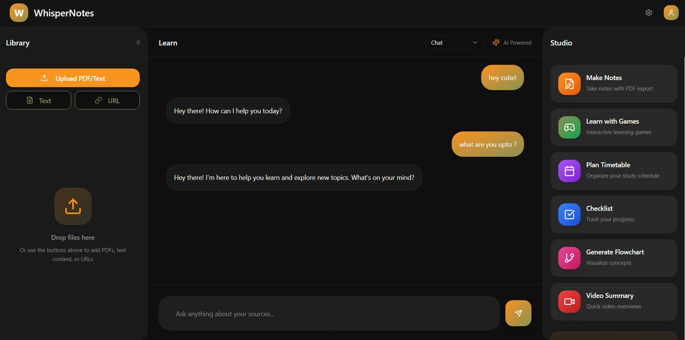
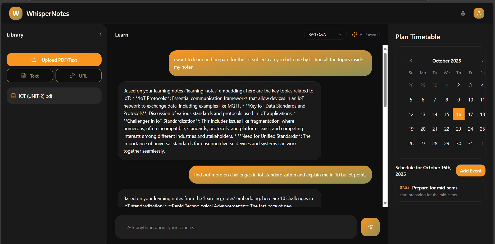

# WhisperNotes  

## Say hii !,
### WhisperNotes - Studying done the correct way! 

## What it aims to deliver ?
- **Study with the correct context**, *add your notes, summarize research papers or articles.*
- **Understand any notes**, *topics by breaking it into chunks.*
- **plan your schdules** *with the ai agents to maximize your time and productivity.*
- **One platform for all your needs**, *combine your notes with yt lectures and tutorial* to understand any topic with ease.*
- **Track your progress** *with the checklists.*
- **Visualize through flowcharts**, *understand any topic to its fundamentals.*
- **Draft,Draw,Write,Scribble**, *make your own notes and save and download them with ease.*
- **Learn by playing**, *understand anything by actually playing and understanding each topic with different quests and story.*
- **Evaluate yourself**, *with quizes,flashcards and throughout strong, weak topics.*

### The Brain Behind the Magic ✨

### The WhisperNotesExperience

*Welcome to your personalized learning space - clean, intuitive, and designed to help you focus on what matters most: learning!*

##  Tech Stack
- **FastAPI Backend**: High-performance, async API responses
- **JWT Authentication**: Secure OAuth-based authentication system
- **Modern Architecture**: Built with scalability and maintainability in mind
- **Pydantic TypeSafety**: Ensurity of type safety and correct structure with high performance.
- **Ai Agent Framework**: Pydantic AI, specially for agent output typesafety and ease of multi agent orchestration.
- **SqlAlchemy with Postgresql**: Quick and efficient database operations
- **Custom Rag Pipeline**: Advanced RAG system that learns with you
- **Chromadb**: For storing and retrieving the embeddings effieciently.

### Slick Frontend Experience
- Built with React + TypeScript for a butter-smooth experience
- Beautiful, responsive design with Tailwind CSS

### API Structure
- Check out `/docs` or `/redoc` for all the technical details

##  Big Thanks To

These awesome tools that help make WhisperNotes possible:
- [FastAPI](https://fastapi.tiangolo.com/) - Our speed demon
- [Pydantic AI](https://pydantic-ai.readthedocs.io/) - Our AI's brain trainer
- [shadcn/ui](https://ui.shadcn.com/) - Making everything look pretty

