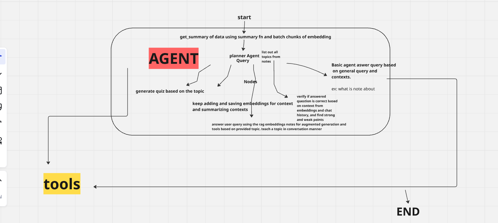

# WhisperNotes 🎓

Hey there!  Welcome to WhisperNotes - where learning meets AI magic! 

Ever wished your study notes could come alive and actually help you learn? That's exactly what we've built! WhisperNotes is your personal AI-powered study buddy that makes learning more engaging, interactive, and (dare we say it?) fun! 

## 📋 See It In Action

### The Brain Behind the Magic ✨

*Here's how our AI agents work together to make your learning experience awesome! Think of it as a team of expert tutors working 24/7 just for you.*

### Your Learning Command Center 

*Welcome to your personalized learning space - clean, intuitive, and designed to help you focus on what matters most: learning!*

## 🌟 Features

###  Your Personal AI 
- **Smart Tutor That Gets You**: Like having a patient teacher available 24/7
- **Memory That Never Fails**: Our RAG system remembers everything you've learned
- **Rock-Solid Reliability**: We've made our AI super dependable with Pydantic AI

### Tools That Make Learning Fun
- **Notes That Think**: Turn boring notes into interactive learning adventures
- **Learn Through Play**: Who said learning can't be fun? Games and quizzes that actually help!
- **Smart Study Buddy**: Get instant summaries and key points without the headache
- **Watch Yourself Grow**: Track your progress and celebrate your wins

### 🔒 Security & Performance
- **FastAPI Backend**: High-performance, async API responses
- **JWT Authentication**: Secure OAuth-based authentication system
- **Modern Architecture**: Built with scalability and maintainability in mind

## 🛠️ Under the Hood 

### Powerful Backend Magic
- **Speed Demon**: FastAPI makes everything lightning fast
- **AI Brainpower**: Pydantic AI keeps our agents sharp and reliable
- **Fort Knox Security**: Rock-solid JWT-based OAuth protection
- **Smart Storage**: Quick and efficient database operations
- **Knowledge Engine**: Advanced RAG system that learns with you

### Slick Frontend Experience
- **Modern Marvel**: Built with React + TypeScript for a butter-smooth experience
- **Looking Good**: Beautiful, responsive design with Tailwind CSS
- **Always in Sync**: State-of-the-art data management

### Before You Start
You'll need these basics:
- Python 3.8 or newer (don't worry, it's easy to install!)
- Node.js 16 or newer (for all the modern web goodness)
- Your favorite modern web browser

### Let's Get You Set Up! 

1. First, grab the code:
```bash
git clone https://github.com/yourusername/whisper-notes.git
cd whisper-notes
```

2. Set up your backend (where the AI magic happens):
```bash
cd backend
python -m venv venv
source venv/bin/activate  # On Windows: .\venv\Scripts\activate
pip install -r requirements.txt
```

3. Get your frontend ready (making things pretty):
```bash
cd frontend
npm install
```

4. Set up your secret sauce (environment variables):
```bash
cp example.env .env
# Add your magical configuration details to .env
```

5. Fire it up! 🔥
```bash
# Backend (Your AI engine)
cd backend
uvicorn app.main:app --reload

# Frontend (Your window to the magic)
cd frontend
npm run dev
```

## 🔧 Making It Your Own

Just a few quick settings and you're ready to roll! Add these to your `.env`:

- `GOOGLE_API_KEY`: Your key to AI superpowers
- `JWT_SECRET_KEY`: Your secret handshake
- `DATABASE_URL`: Where all the learning magic is stored
- Want more? Check out `config.py` for extra customization!

## 📖 Want to Know More?

### API Goodies
- Check out `/docs` or `/redoc` for all the technical details
- Peek into `app/schemas/` if you're curious about the data structure

### Meet Your AI Teaching Team
Our AI system is like a team of specialized teachers:
- Different experts for different subjects
- Super reliable thanks to Pydantic
- Smart memory system (RAG) that grows with you
- Keeps track of everything you learn
- Gamified paltform to learn

##  Big Thanks To

These awesome tools that help make WhisperNotes possible:
- [FastAPI](https://fastapi.tiangolo.com/) - Our speed demon
- [Pydantic AI](https://pydantic-ai.readthedocs.io/) - Our AI's brain trainer
- [shadcn/ui](https://ui.shadcn.com/) - Making everything look pretty

---

*PS: Keep those API keys safe and sound! Never let them slip into your code commits* 
